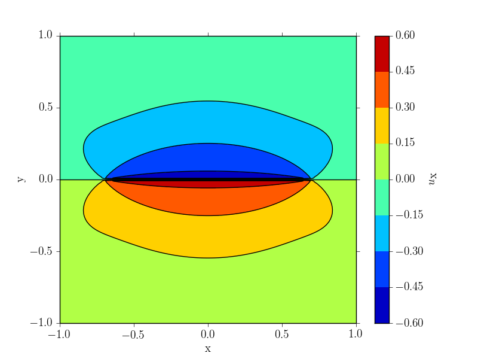

#### Okada wrapper (MATLAB, Python)

These files are MATLAB and Python wrappers for the Okada DC3D0 point source
and the DC3D rectangular dislocation surface fortran subroutines. The Matlab 
wrappers are written using the MEX functions. The original subroutine was 
written by Y. Okada as part of the paper:

**Okada, Y., 1992, Internal deformation due to shear and tensile faults in a half-space, Bull. Seism. Soc. Am., 82, 1018-1040.**

The inputs and outputs here are slightly different from the okada implementation,
though not in any substantial way. Look at the [original documentation webpage
here](http://www.bosai.go.jp/study/application/dc3d/DC3Dhtml_E.html) for more details

#### MATLAB

Download the code::

```
git clone https://github.com/tbenthompson/okada_wrapper.git
```

Open matlab and run::

```
mex 'DC3D0wrapper.F'
```

Then, DC3D0wrapper can be treated like any other MATLAB function::

```
[success, u, grad_u] = DC3D0wrapper(0.6, [1.0, 1.0, -1.0],-3.0,...
                                    1.0, [1.0, 0.0, 0.0, 0.0]);
```


Five arguments are required:

* alpha = (lambda + mu) / (lambda + 2 * mu)
* xo = 3-vector representing the observation point (x, y, z in the
       original)
* depth = the depth of the slip plane
* dip = the dip-angle of the slip plane in degrees
* potency = 4-vector (POT1,2,3,4 in original)
  * index 1 = strike-slip = Moment of double-couple / mu
  * index 2 = dip-slip = Moment of double-couple / mu
  * index 3 = inflation = Intensity of isotropic part / lambda
  * index 4 = tensile = Intensity of linear dipole / mu

Three outputs are provided:

* success - a return code from DC3D0=0 if normal, 1 if singular, 2 if a positive z value for the observation point was given
* u - 3-vector representing the displacement at the observation point. for example, u(2) = u_y
* grad_u = the 3x3 tensor representing the partial derivatives of the displacement, for example, grad_u(1, 2) = d(u_x)/dy


Python
----

Download the code::

    git clone https://github.com/tbenthompson/okada_wrapper.git

Then, run the install script::

    python setup.py install

The syntax is almost identical to the MATLAB version::

    from okada_wrapper import dc3d0wrapper
    success, u, grad_u = dc3d0wrapper(0.6, [1.0, 1.0, -1.0], 3.0,
                                      1.0, [1.0, 0.0, 0.0, 0.0])

The arguments and outputs are identical to the MATLAB version.

Tests
----

To run the tests, from the root directory in MATLAB type::

    test_okada.m

or, for python::
    
    python test_okada.py

which produces this beautiful figure:


